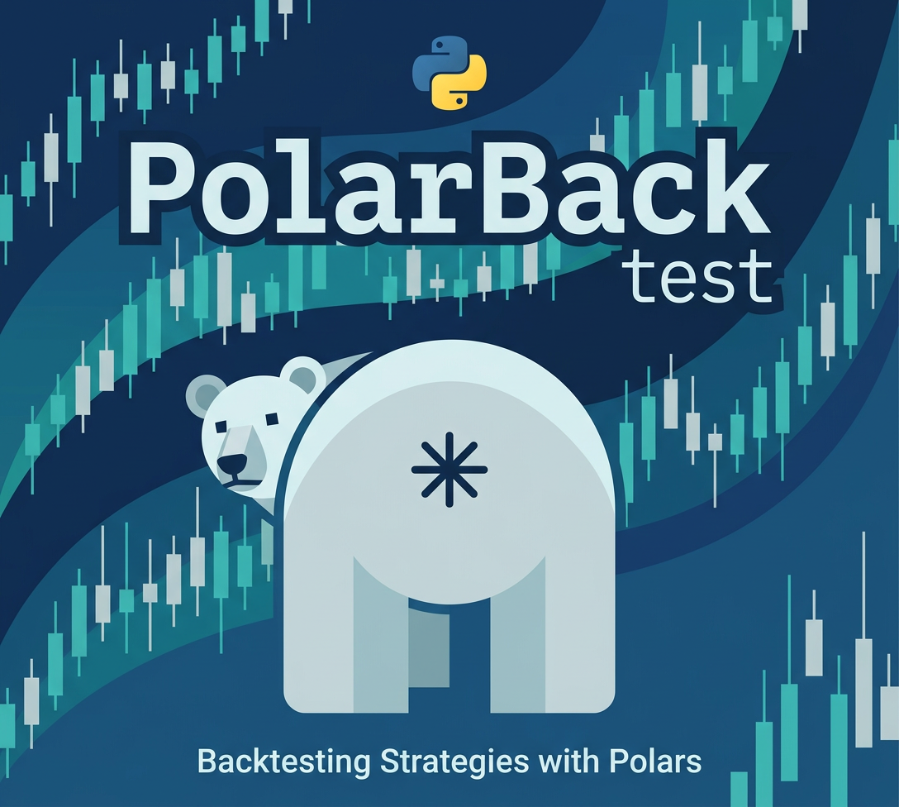
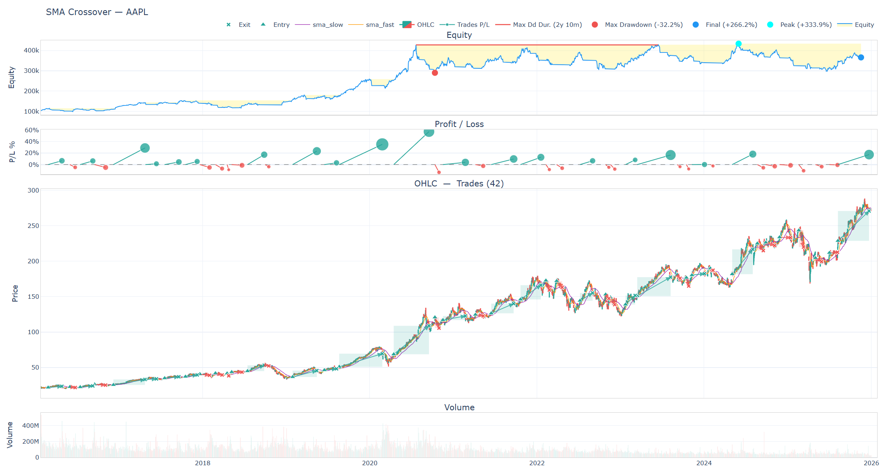

<p align="center">
  
</p>

# Polar BackTest

A lightweight, high-performance backtesting library for trading strategy development and optimization. Built on [Polars](https://pola.rs/) for fast vectorized data processing with an event-driven execution loop for flexible strategy logic.

## Features

- **Hybrid architecture** — vectorized preprocessing (Polars) + event-driven execution loop
- **25+ built-in indicators** — SMA, EMA, RSI, MACD, Bollinger Bands, ATR, SuperTrend, ADX, and more
- **Complete order system** — market, limit, stop, stop-limit, bracket orders, day/GTC orders
- **Risk management** — stop-loss, take-profit, trailing stops, position size limits, drawdown stops
- **Short selling** — negative positions, borrow costs, position reversals
- **Margin & leverage** — configurable leverage, margin tracking, margin calls
- **Commission models** — percentage, fixed, maker/taker, volume-tiered, custom
- **Position sizing** — fixed, percent, fixed-risk, Kelly, volatility-based
- **Weight-based backtesting** — declarative portfolio allocation with `backtest_weights()` or `WeightStrategy`, rebalance scheduling, stop-loss/take-profit, next-actions output
- **Multi-asset** — pass a dict of DataFrames or a long-format DataFrame with `symbol` column; all OHLC data preserved
- **Dynamic universe** — `UniverseProvider` protocol filters tradeable symbols per bar; built-in `AgeFilter`, `VolumeFilter`, `TopN`, `CompositeFilter`; token lifecycle tracking via `ctx.first_seen_bar` / `ctx.bar_count`
- **Parallel optimization** — grid search, multi-objective Pareto, Bayesian optimization
- **Walk-forward analysis** — rolling and anchored train/test splits
- **Advanced analysis** — Monte Carlo simulation, look-ahead bias detection, permutation testing
- **Visualization** — interactive Plotly charts (price, equity, drawdown, trade markers, heatmaps)
- **Trade data pipeline** — validate and aggregate raw DEX/AMM trades into OHLCV bars (time-based or trade-count), with buy/sell volume split, VWAP, and optional USD conversion
- **Data utilities** — validation, cleaning, OHLCV resampling
- **Optional TA-Lib integration** — wrap any TA-Lib function into Polars expressions

## Installation

```bash
pip install polarbt
```

Or with optional extras:

```bash
pip install polarbt[plotting]   # Plotly charts
pip install polarbt[talib]      # TA-Lib integration
```

Install from source:

```bash
git clone git@github.com:nikkisora/PolarBT.git
cd PolarBT
pip install -e .
```

## Quick Start

```python
import polars as pl
import yfinance as yf
from polarbt import Engine, Strategy
from polarbt import indicators as ind
from polarbt.core import BacktestContext
from polarbt.plotting import plot_backtest


class SMACross(Strategy):
    def preprocess(self, df: pl.DataFrame) -> pl.DataFrame:
        return df.with_columns(
            ind.sma("close", 10).alias("sma_fast"),
            ind.sma("close", 30).alias("sma_slow"),
        ).with_columns(
            ind.crossover("sma_fast", "sma_slow").alias("buy"),
            ind.crossunder("sma_fast", "sma_slow").alias("sell"),
        )

    def next(self, ctx: BacktestContext) -> None:
        if ctx.row.get("buy"):
            ctx.portfolio.order_target_percent("asset", 1.0)
        elif ctx.row.get("sell"):
            ctx.portfolio.close_position("asset")


# Download data from Yahoo Finance
ticker = yf.download("AAPL", start="2016-01-01", end="2026-01-01", auto_adjust=True)
ticker = ticker.droplevel("Ticker", axis=1).reset_index()
data = pl.from_pandas(ticker)

# Run backtest
engine = Engine(SMACross(), data, commission=.005, initial_cash=100_000)
results = engine.run()

print(results)

# Interactive chart saved to HTML
fig = plot_backtest(engine, title="SMA Crossover — AAPL", indicators=["sma_fast", "sma_slow"])
fig.write_html("backtest.html")

```

```text
Equity Final [$]                        366,236.83
Equity Peak [$]                         433,930.72
Return [%]                                  266.24
Buy & Hold Return [%]                      1044.52
Return (Ann.) [%]                            14.08
CAGR [%]                                     14.08
Volatility (Ann.) [%]                        19.78

Sharpe Ratio                                  0.76
Sortino Ratio                                 0.92
Calmar Ratio                                  0.44
Max. Drawdown [%]                           -32.16
Avg. Drawdown Duration [bars]                   38
Max. Drawdown Duration [bars]                  730

# Trades                                        42
Win Rate [%]                                 47.62
Best Trade [%]                               57.11
Worst Trade [%]                             -13.43
Avg. Trade [%]                                3.94
Max. Trade Duration [bars]                     128
Avg. Trade Duration [bars]                      39
Avg. Trade MDD [%]                           -8.78
Profit Factor                                 1.79
Expectancy [$]                             6338.97
SQN                                           1.27
Kelly Criterion                             0.2098
```
<p align="center">
  
</p>

## Weight-Based Backtesting

For portfolio allocation strategies, skip the event loop entirely — just supply target weights per (date, symbol):

```python
import polars as pl
from polarbt import backtest_weights

# data: long-format DataFrame with columns date, symbol, close, weight
result = backtest_weights(
    data,
    resample="M",           # rebalance monthly
    resample_offset="2d",   # delay 2 trading days after month boundary
    fee_ratio=0.001,
    stop_loss=0.10,          # 10% per-position stop-loss
    position_limit=0.5,      # max 50% in any single name
    initial_capital=100_000,
)

print(result.metrics)        # standard BacktestMetrics
print(result.trades.head())  # per-trade log
print(result.next_actions)   # forward-looking rebalance actions
```

## Examples

| Example | Description |
|---|---|
| [`example.py`](examples/example.py) | Basic SMA crossover |
| [`example_sma_crossover_stoploss.py`](examples/example_sma_crossover_stoploss.py) | SMA crossover with ATR stop-loss and trailing stop |
| [`example_rsi_bracket_orders.py`](examples/example_rsi_bracket_orders.py) | RSI mean reversion with bracket orders |
| [`example_momentum_rotation.py`](examples/example_momentum_rotation.py) | Multi-asset momentum rotation |
| [`example_ml_strategy.py`](examples/example_ml_strategy.py) | ML model integration |
| [`example_walk_forward.py`](examples/example_walk_forward.py) | Walk-forward analysis workflow |
| [`example_advanced_analysis.py`](examples/example_advanced_analysis.py) | Full workflow: optimization, heatmaps, Monte Carlo, permutation test |
| [`example_limit_orders.py`](examples/example_limit_orders.py) | Limit orders and stop-loss |
| [`example_trade_analysis.py`](examples/example_trade_analysis.py) | Trade-level analysis |
| [`example_plotting.py`](examples/example_plotting.py) | Interactive chart generation |
| [`example_commission.py`](examples/example_commission.py) | Commission model comparison |
| [`example_multi_asset.py`](examples/example_multi_asset.py) | Multi-asset dict input |
| [`example_weight_backtest.py`](examples/example_weight_backtest.py) | Weight-based portfolio backtest |

## Documentation

- [Getting Started Guide](docs/getting-started.md)
- [API Reference](docs/api-reference.md)
- [Complete Reference](docs/complete-reference.md)

## License

[MIT](LICENSE)
